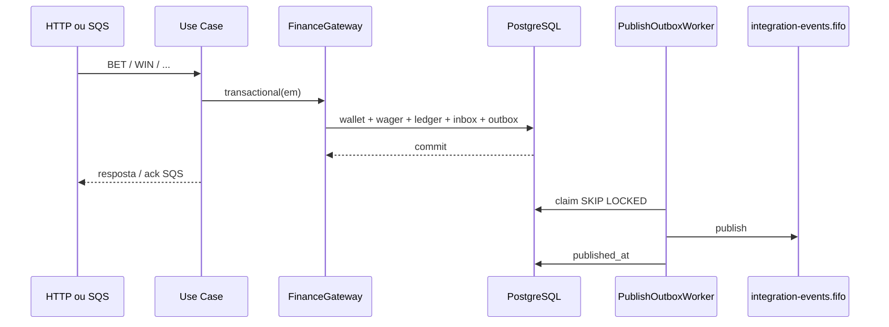

# Architecture — Distributed Wagering Processor

Este documento registra as decisões técnicas da implementação e o raciocínio por trás delas. O enunciado completo do desafio está em [`README.md`](./README.md). Para subir a stack, rodar testes manuais e automatizados, consulte [`DOCKER.md`](./DOCKER.md).

## Visão geral

A aplicação é um monólito modular em **NestJS + Bun**, organizado em camadas com fronteiras explícitas:

| Camada | Responsabilidade |
|---|---|
| **Domain** | Invariantes financeiras (`Money`, `Wallet`, `WagerTransaction`, ledger, inbox/outbox, eventos) |
| **Application** | Use cases, ports e orquestração; o mesmo `ProcessWagerTransactionUseCase` atende HTTP e SQS |
| **Infrastructure** | MikroORM/PostgreSQL, SQS (MiniStack), HTTP e observabilidade |
| **Modules** | Composição NestJS (`FinanceModule`, `MessagingModule`, `ApiModule`) |

### Fluxo end-to-end



**Por que monólito modular?** O desafio pede correção financeira com múltiplas instâncias, não a separação em microserviços. Manter wallet, ledger e outbox na mesma transação SQL é muito mais simples dentro de um único deploy do que coordenar o mesmo efeito entre serviços distintos, o que exigiria 2PC ou sagas bem mais complexas.

## MikroORM e persistência

### Por que MikroORM

O README indica MikroORM como opção preferencial porque expõe **Unit of Work** e **Identity Map** de forma explícita. Na prática, o projeto usa:

- `EntityManager.transactional()` para delimitar a fronteira transacional de cada operação financeira;
- `LockMode.PESSIMISTIC_WRITE` nas reversões, onde a ordem referência → mutação importa;
- migrations versionadas e reversíveis via `@mikro-orm/migrations`.

TypeORM seria aceitável, mas MikroORM combina melhor com o padrão adotado aqui que é gateway dedicado e transação explícita por operação de negócio.

### FinanceGateway: ORM e SQL raw na mesma transação

Operações críticas de concorrência (débito e crédito atômicos, `INSERT ON CONFLICT`, `FOR UPDATE SKIP LOCKED`) usam SQL raw porque precisam de controle fino sobre `WHERE` e `RETURNING`.

Leituras e escritas simples continuam no ORM (`persist`, `flush`).

Tudo passa pelo `FinanceGateway` ou `MessagingGateway`, instanciados dentro de `unitOfWork.transactional(async (em) => ...)`. Isso garante um único `EntityManager` e uma única transação SQL por operação de negócio.

**Por que não usar só ORM?** Um fluxo `find` + `save` para débito é read-modify-write sem garantia atômica. O PostgreSQL resolve o hot wallet com `UPDATE ... WHERE balance >= ? RETURNING`, sem precisar segurar lock durante validações de negócio.

**Por que `em.execute()` em vez de `em.getConnection().execute()`?** O `em.execute()` propaga o contexto da transação ativa. SQL disparado via `getConnection()` pode rodar fora da transação e gerar violação de FK, como acontece quando a wallet foi persistida pelo ORM mas ainda não é visível para um INSERT raw paralelo.

### ReflectMetadataProvider no Docker

A imagem de produção contém apenas `dist/`, sem os arquivos `src/`. O `TsMorphMetadataProvider` depende dos fontes TypeScript originais, então a configuração adota:

- registro explícito das entities em `mikro-orm.config.ts`;
- `ReflectMetadataProvider` sempre ativo, funcionando com decorators compilados em JavaScript.

### Identificadores: UUID v7

Ids gerados pela aplicação usam UUID v7. Por ser time-ordered, melhora a locality em índices B-tree do PostgreSQL em relação ao v4 aleatório, sem perder unicidade global.

## Schema PostgreSQL

As garantias exigidas no README (seção 5) vivem no banco, não apenas no código da aplicação:

| Invariante | Mecanismo |
|---|---|
| Uma wallet por `(playerId, currency)` | `UNIQUE (player_id, currency)` |
| Saldo nunca negativo | `CHECK (balance >= 0)` |
| Idempotência persistente | `UNIQUE (idempotency_key)` |
| Id externo único por provedor | `UNIQUE (provider_id, external_transaction_id)` |
| Reversão única por referência | índice parcial `UNIQUE (reference_transaction_id, kind) WHERE kind IN ('REFUND','ROLLBACK') AND status = 'PROCESSED'` |
| Um lançamento por transação/wallet | `UNIQUE (wallet_id, transaction_id)` no ledger |
| Ledger estruturalmente balanceado | `CHECK` aritmético (`balance_before ± amount = balance_after`) |
| Ledger imutável | trigger `BEFORE UPDATE OR DELETE` |
| Valores monetários exatos | `NUMERIC(19,2)` mapeado para `string` via `MoneyAmountType` |

**Por que trigger de imutabilidade?** O README proíbe alterar lançamentos do ledger. O trigger impede mutação mesmo por SQL manual ou por regressão futura na aplicação.

## Dinheiro

Valores monetários passam por `decimal.js` encapsulado em `Money`, que é imutável. No PostgreSQL, `NUMERIC(19,2)` é mapeado para `string` via `MoneyAmountType`; a aplicação nunca usa `number` do JavaScript para representar dinheiro.

Toda operação valida moeda explicitamente e lança `CurrencyMismatchError` quando há divergência. Na prática o desafio assume **BRL**, mas o modelo continua multi-moeda e os testes cobrem conflito de moeda.

**Por que string + decimal.js?** O tipo `number` em JavaScript segue IEEE 754 binário. Operações como centavos quebram invariantes financeiras de forma silenciosa. String decimal com biblioteca dedicada elimina esse risco.

## WagerTransaction: estados e transições

### Estados terminais

`PROCESSED`, `REJECTED` e `FAILED` são finais. Qualquer tentativa de transição depois disso lança `InvalidTransactionStateError`, sinalizando erro de programação e não um caminho válido de negócio.

### Diagrama de transições

```
PENDING ──process──► PROCESSED
   │
   ├──reject (regra de negócio)──► REJECTED
   │
   ├──fail (pré-condição/infra)──► FAILED
   │
   └──ref ausente──► PENDING_REFERENCE ──retry──► PROCESSED | REJECTED
                              └── (10 tentativas) ──► REJECTED (REFERENCE_NOT_FOUND)
```

### REJECTED vs FAILED

| Status | Significado | Exemplos |
|---|---|---|
| **REJECTED** | Regra de negócio violada; o provedor deve corrigir o payload ou desistir | Saldo insuficiente, referência inválida, reversão duplicada, valor de refund divergente |
| **FAILED** | Pré-condição de dados ou infraestrutura não atendida | Wallet inexistente para o `walletId` informado |

**Por que separar os dois?** Rejeição de negócio mapeia para HTTP 422, enquanto dados inconsistentes podem ir para 404 ou 500. Isso ajuda o provedor a distinguir “ajuste o valor e reenvie” de “o payload referencia uma wallet que não existe”.

### OPENING (interno)

Quando a wallet é criada com saldo inicial maior que zero, a aplicação gera uma transação `OPENING` na mesma transação SQL da wallet:

- `idempotencyKey`: `opening:{walletId}`;
- lançamento `CREDIT` no ledger;
- eventos `WalletBalanceChanged` e `WagerTransactionProcessed` na outbox;
- rejeição via API HTTP ou fila SQS com `InvalidTransactionStateError`.

### observed_balance

Campo que guarda o saldo da wallet **no momento em que a transação foi processada ou rejeitada**.

Em replay idempotente, a API devolve esse valor histórico, não o saldo atual. Assim a resposta permanece idêntica à da primeira execução, mesmo que outras transações tenham movimentado a wallet depois.

### Taxonomia de FailureCode

| Código | Quando |
|---|---|
| `INSUFFICIENT_BALANCE` | BET sem saldo |
| `REVERSAL_WOULD_CAUSE_NEGATIVE_BALANCE` | REFUND ou ROLLBACK deixaria saldo negativo |
| `INVALID_REFERENCE` | Referência existe, mas kind ou escopo é inválido |
| `REFERENCE_NOT_FOUND` | Referência ausente após esgotar retries |
| `REFERENCE_ALREADY_REVERSED` | Segunda reversão do mesmo tipo |
| `INVALID_REFUND_AMOUNT` / `INVALID_ROLLBACK_AMOUNT` | Valor diverge da referência |
| `CURRENCY_MISMATCH` | Moeda da operação diferente da moeda da wallet |
| `WALLET_NOT_FOUND` | Wallet inexistente (também associado a `FAILED`) |
| `DUPLICATE_WALLET` | Segunda wallet para o mesmo par player + moeda |
| `IDEMPOTENCY_CONFLICT` | Mesma key com payload diferente |
| `INVALID_TRANSACTION_STATE` | Transição ilegal |
| `INVALID_PAYLOAD` | Mensagem ou corpo malformado |
| `REFERENCE_SCOPE_MISMATCH` | Referência pertence a outro provider, player, wallet ou round |

### Regras de referência

1. A referência é resolvida por `(providerId, referenceExternalTransactionId)`.
2. Ela deve pertencer ao mesmo provider, player, wallet, moeda e round da transação que a referencia.
3. `REFUND` só pode referenciar uma `BET` já processada.
4. `ROLLBACK` pode referenciar `BET`, `WIN` ou `REFUND` já processada.
5. O valor da reversão deve ser igual ao da referência; reversão parcial está fora de escopo.

## Idempotência

A chave canônica é o header HTTP `Idempotency-Key` ou o campo equivalente na mensagem SQS. O formato recomendado é `{providerId}:{externalTransactionId}`.

A persistência usa `INSERT INTO wager_transactions (...) ON CONFLICT (idempotency_key) DO NOTHING`. Replay com o mesmo payload devolve a resposta original e marca `idempotentReplay: true`. Mesma key com payload diferente resulta em `409 Conflict` (`IdempotencyConflictError`).

### payloadHash

O hash é SHA-256 sobre JSON canônico, com chaves de objetos ordenadas recursivamente (`toCanonicalJson`).

Campos considerados (`buildWagerPayloadHashInput`):

```
providerId, externalTransactionId, playerId, walletId,
roundId, gameId, kind, money { amount, currency },
referenceExternalTransactionId (se presente)
```

Ficam de fora o header `Idempotency-Key`, metadados de transporte e timestamps. Só o subconjunto de negócio entra no hash, para separar replay legítimo de conflito real.

## Concorrência por wallet

A unidade de serialização é o `walletId`.

| Operação | Estratégia | Motivo |
|---|---|---|
| BET (débito) | `UPDATE ... SET balance = balance - ? WHERE id = ? AND balance >= ? RETURNING` | Atômico; rejeita débito sem lock explícito quando o saldo não basta |
| WIN (crédito) | `UPDATE ... SET balance = balance + ? RETURNING` | Crédito não precisa guarda de saldo |
| REFUND/ROLLBACK | `SELECT ... FOR UPDATE` na wallet + validação da referência | A ordem referência → mutação importa e evita dupla reversão |
| Inbox/Outbox claim | `INSERT ON CONFLICT` / `FOR UPDATE SKIP LOCKED` | Dedup e distribuição de trabalho entre instâncias |

Recursos de ordenação e deduplicação do SQS FIFO são otimização. **O banco continua sendo a fonte da verdade.**

**Por que evitar lock global?** Serializaria todas as wallets e destruiria o throughput. Serializar por `walletId` preserva paralelismo entre jogadores diferentes.

## Inbox (SQS)

A deduplicação usa `(consumer_name, message_id)` com `INSERT ... ON CONFLICT DO NOTHING`.

Inbox, processamento financeiro e outbox participam da mesma transação SQL. O ack no SQS só ocorre após o commit. Em redelivery, se o registro de inbox existe sem `processed_at`, o consumer reprocessa com idempotência financeira, produzindo o mesmo efeito sem débito duplicado.

**Por que inbox persistente?** Entrega at-least-once implica mensagens repetidas. Dedup em memória ou só no broker não sobrevive a restart e não funciona com múltiplas instâncias.

## Transactional Outbox

Eventos de integração são gravados na outbox na mesma transação da mutação financeira.

O `PublishOutboxWorker` faz claim com `SELECT ... FOR UPDATE SKIP LOCKED`, publica no SQS e marca `published_at` ainda dentro da transação. Se a publicação falha, `scheduleRetry()` aplica backoff exponencial (base 1s, máximo 60s). Publicação duplicada é segura porque consumidores deduplicam por `eventId`.

**Por que outbox?** Publicar no SQS antes do commit abre uma janela em que o evento existe, mas a transação financeira ainda pode falhar. A outbox inverte a ordem: commit primeiro, publish depois, com retry idempotente.

### Eventos de integração

Publicados na fila `integration-events.fifo`:

| Evento | Quando dispara |
|---|---|
| `WagerTransactionProcessed` | Transação aplicada, incluindo `LOSS`, que não altera saldo |
| `WagerTransactionRejected` | Rejeição por regra de negócio |
| `WalletBalanceChanged` | Somente quando o saldo materializado muda |
| `WagerTransactionPendingReference` | REFUND ou ROLLBACK com referência ainda ausente |

O envelope serializado (`IntegrationEvent.toJSON()`) contém `eventId`, `eventType`, `aggregateId`, `correlationId`, `occurredAt`, `version` e `data`. O payload usa `MoneyProps` com string decimal, nunca a instância de `Money`.

## Workers e mensageria

Três workers rodam no mesmo processo NestJS quando `MESSAGING_ENABLED=true`:

| Worker | Função | Intervalo |
|---|---|---|
| `WagerTransactionConsumer` | Consome `wager-transactions.fifo`, deduplica via inbox e chama `ProcessInboundWagerMessageUseCase` | `SQS_POLL_INTERVAL_MS` (default 1s) |
| `PublishOutboxWorker` | Faz claim da outbox e publica em `integration-events.fifo` | `OUTBOX_POLL_INTERVAL_MS` (default 1s) |
| `ReprocessPendingReferenceWorker` | Reprocessa transações `PENDING_REFERENCE` elegíveis | 5s fixo, batch de 20 |

### Filas SQS

| Fila | Uso |
|---|---|
| `wager-transactions.fifo` | Entrada de apostas consumidas pelo worker |
| `wager-transactions-dlq.fifo` | Mensagens inválidas ou que excederam `SQS_MAX_RECEIVE_COUNT` (default 5) |
| `integration-events.fifo` | Saída dos eventos publicados pela outbox |

HTTP e SQS convergem no mesmo `ProcessWagerTransactionUseCase`. A diferença está na camada de entrada: controller HTTP ou consumer SQS com inbox.

### Disposição de mensagens no consumer

| Resultado | Ação |
|---|---|
| Sucesso ou terminal de negócio | Ack (delete da fila) |
| Erro transitório | Retry com visibility timeout crescente, até o limite de receive count |
| Payload inválido ou excesso de retries | DLQ e incremento da métrica `dlq_messages_total` |

### Shutdown (SIGTERM)

No `onModuleDestroy`, o consumer aguarda mensagens in-flight terminarem. Mensagens ainda não confirmadas têm a visibility resetada para zero e voltam à fila, permitindo que outra instância assuma sem perda.

## Referências fora de ordem

REFUND ou ROLLBACK sem referência resolvível entram em `PENDING_REFERENCE`.

O `ReprocessPendingReferenceWorker` reaplica backoff exponencial (base 1s, máximo 60s) por até **10 tentativas**. Ao esgotar o limite, a transação vai para `REJECTED` com `REFERENCE_NOT_FOUND` e dispara `WagerTransactionRejected`.

**Por que não rejeitar de imediato?** Com entrega at-least-once e ordem não garantida, a BET pode chegar segundos depois do REFUND. Persistir como pendente evita descartar uma reversão legítima.

## API HTTP

### Endpoints

| Método | Rota | Descrição |
|---|---|---|
| `POST` | `/wallets` | Cria wallet; gera OPENING se saldo inicial > 0 |
| `GET` | `/wallets/:walletId` | Consulta wallet |
| `GET` | `/wallets/:walletId/ledger?cursor=&limit=` | Ledger paginado |
| `POST` | `/wagering/transactions` | Submete transação; exige header `Idempotency-Key` |
| `GET` | `/wagering/transactions/:transactionId` | Consulta por id interno |
| `GET` | `/providers/:providerId/wagering/transactions/:externalTransactionId` | Consulta por id do provedor |
| `POST` | `/wallets/:walletId/reconciliation` | Compara saldo materializado com a soma do ledger |
| `GET` | `/health/live` | Liveness |
| `GET` | `/health/ready` | Readiness |
| `GET` | `/metrics` | Métricas Prometheus |

### Paginação do ledger

O cursor é opaco: `base64url(JSON({ createdAt: ISO-8601, id: uuid }))`.

A ordenação é estável por `(created_at ASC, id ASC)`. O limite padrão é 50 entradas; o máximo permitido é 100.

**Por que cursor composto?** `created_at` sozinho não garante ordem única quando dois lançamentos compartilham timestamp. Incluir `id` desempata de forma determinística.

### Mapeamento de status HTTP

| Situação | HTTP |
|---|---|
| Payload ou header inválido | 400 |
| Wallet ou transação não encontrada | 404 |
| Wallet duplicada ou conflito de idempotência | 409 |
| Rejeição de negócio (`REJECTED`) | 422, corpo inclui `failureCode` |
| Referência pendente (`PENDING_REFERENCE`) | 202 |
| Processado ou replay idempotente | 200 |
| Readiness degradado | 503 em `/health/ready` |

## Autenticação

Autenticação não foi implementada nesta entrega. A decisão priorizou correção financeira dentro do timebox do desafio.

Rotas de negócio passam por um `AuthGuard` no-op. Health e métricas permanecem abertos. A extensão natural é substituir o guard por validação OIDC (Keycloak ou Zitadel) sem alterar os use cases.

## Observabilidade

### Logs

Logs estruturados em JSON via `StructuredLoggingInterceptor`, incluindo `correlationId`, `walletId`, `providerId` e duração. Payloads financeiros completos não são registrados.

### Métricas (`/metrics`)

| Métrica | Descrição |
|---|---|
| `wager_transactions_total{status,kind}` | Volume por status e tipo |
| `idempotency_duplicates_total` | Replays idempotentes detectados |
| `reconciliation_mismatch_total` | Divergências entre wallet e ledger |
| `dlq_messages_total` | Mensagens enviadas à DLQ |
| `outbox_pending_messages` | Eventos ainda não publicados |
| `wager_processing_latency_seconds{kind}` | Latência de processamento |

O endpoint também expõe métricas default do Node via `collectDefaultMetrics`.

Métricas dedicadas de retry ou conflito de lock não foram implementadas. Conflitos de débito aparecem como transação `REJECTED` com HTTP 422.

### Health checks

- **`/health/live`**: retorna `{ status: "ok" }` enquanto o processo responder.
- **`/health/ready`**: executa `SELECT 1` no PostgreSQL e `GetQueueAttributes` na fila de wager. Qualquer falha retorna `503` com detalhe por dependência.

## Reconciliação

`POST /wallets/:walletId/reconciliation` compara o saldo materializado da wallet com a soma reconstruída a partir do ledger.

Divergências não são corrigidas automaticamente. Elas são logadas, contabilizadas em `reconciliation_mismatch_total` e devolvidas na resposta da API.

## Testes

Scripts, variáveis de ambiente e fluxo de execução estão descritos em [`DOCKER.md`](./DOCKER.md).

Nos testes de integração e concorrência, após cada cenário relevante, vale a invariante:

```
wallet.balance == saldo reconstruído pelo ledger
```

## Limitações conhecidas

- Mensageria SQS tratada como canal interno confiável, sem autenticação na fila.
- Reversão parcial fora de escopo.
- Multi-moeda por player modelada como uma wallet por `(playerId, currency)`.
- Sem `test:load` (diferencial opcional do README).
- Reinício completo do serviço com verificação automatizada de consistência final não coberto de ponta a ponta; cenários parciais são exercitados via recovery da outbox e redelivery de mensagens.
